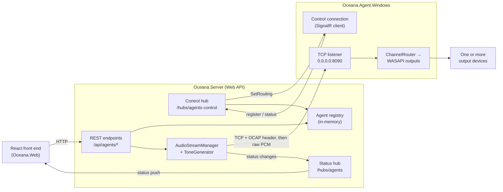
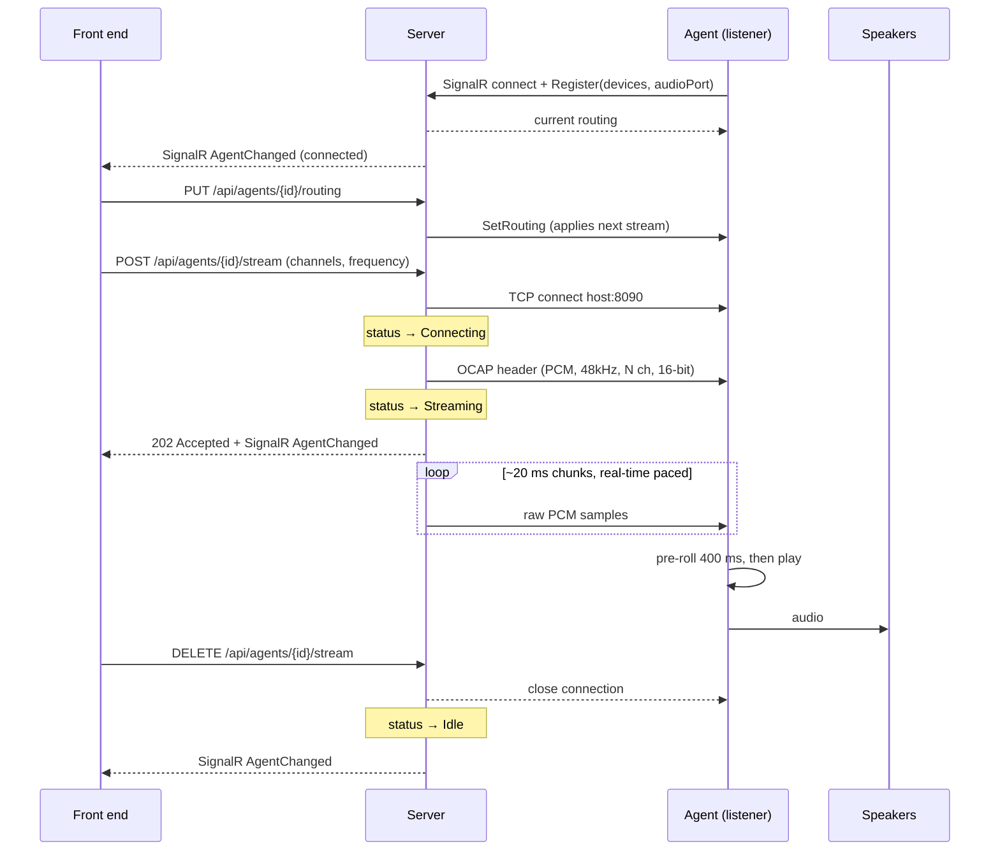

# Architecture

> How Oceana's pieces fit together, how the server and agent connect, and how audio flows end to end.

## Components

Oceana is three deployable/shared pieces plus a planned front end:

| Component | Project | Role |
|-----------|---------|------|
| **Protocol** | [`Oceana.Protocol`](../src/Oceana.Protocol) | Shared library defining the OCAP binary wire format (the audio handshake header). No dependencies on Windows/NAudio/ASP.NET. |
| **Contracts** | [`Oceana.Contracts`](../src/Oceana.Contracts) | Shared DTOs for the agent↔server SignalR control plane (registration, devices, routing). Referenced by both server and agent. |
| **Agent** | [`Oceana.Agent.Windows`](../src/Oceana.Agent.Windows) | Runs on a playback machine. Listens for audio, opens an outbound control connection to the server to self-register and receive routing, then de-interleaves and plays channel subsets across one or more devices. |
| **Server** | [`Oceana.Server`](../src/Oceana.Server) | Central control plane. Tracks self-registered agents, pushes their routing, and streams audio to them. Exposes a REST + SignalR API. |
| **Front end** | [`Oceana.Web`](../src/Oceana.Web) | A React + MUI SPA (Vite + TypeScript) that drives the server's REST API and subscribes to the `/hubs/agents` and `/hubs/zones` SignalR hubs for live status. Manages agents and **zones** (named groups of devices). See [web.md](./web.md). |

## The connection model (important)

The direction of the network connection is deliberately **inverted** from what people often assume:

- The **agent is a TCP listener**. It binds `0.0.0.0:8090` (all interfaces) and waits.
- The **server is the TCP client**. When told to stream to an agent, it **dials out** to that agent's `host:port`, sends a handshake header, then pushes audio.

For **control**, the direction is the opposite: the **agent dials the server**, opening a persistent SignalR connection to `/hubs/agents-control` on startup. Over it the agent **self-registers** (reporting its devices and audio port) and receives routing pushes. The server derives the agent's audio host from that control connection — so it knows where to dial for audio, with **no manual registration**.

> **Why split control and data this way?** Audio stays a dumb, firewall-simple TCP push the server initiates; control is an outbound agent connection, which is NAT-friendly and gives the server live presence + self-discovery. The server owns *when* audio flows and *how* it's routed; the agent owns playback. (See [server.md](./server.md#agent-control-plane).)

## End-to-end data flow

Two planes: the **data plane** is audio, **server → agent** over TCP; the **control plane** is **agent → server** over SignalR (self-register + routing pushes) plus **front end ↔ server** (REST + status hub). The agent and front end never talk directly.

### Starting a stream (sequence)

Details of the header live in [protocol.md](./protocol.md); the playback side in [agent.md](./agent.md); the server side in [server.md](./server.md).

## Server-side structure: vertical slices + shared infrastructure

The server is organised by **feature (vertical slice)** rather than by technical layer:

- `Features/Agents/` — the **Agents slice**: one folder per endpoint (REPR-style), plus the agent registry and domain models.
- `Infrastructure/Streaming/` and `Infrastructure/Realtime/` — **shared** technical services (tone generation, the TCP connection, SignalR plumbing) that aren't a feature in themselves.

> **Intentional dependency note.** The shared `Infrastructure` code references the Agents slice's domain types (`AgentInfo`, `AgentStatus`, `IAgentRegistry`). While **Agents is the only slice**, this is fine — infrastructure serving the sole domain. When a second slice appears, those shared contracts should be lifted into a neutral "kernel" so infrastructure no longer depends on a specific slice. Tracked in [roadmap.md](./roadmap.md).

## Glossary

| Term | Meaning |
|------|---------|
| **Agent** | A playback endpoint (`Oceana.Agent.Windows`) that plays audio. It's the audio TCP *listener* and the control-plane SignalR *client* (dials the server). |
| **Zone** | A named, user-managed group of audio devices (drawn from one or more agents) intended to be streamed to together. Managed server-side (in-memory) and in the front end; a **zone broadcast** plays a recorded mic message on every reachable device in the zone. |
| **Server** | The control plane (`Oceana.Server`) that tracks agents, pushes routing, and streams audio. It's the audio TCP *client* and hosts the control + status hubs. |
| **Control plane / data plane** | Control = agent↔server SignalR (registration, routing, status). Data = the server→agent TCP audio stream. |
| **OCAP** | "Oceana Audio Protocol" — the wire format: a fixed 16-byte handshake header followed by raw PCM. See [protocol.md](./protocol.md). |
| **Pre-roll** | The amount of audio the agent buffers (400 ms) before it starts playing, to absorb network jitter. |
| **REPR** | Request–Endpoint–Response — the FastEndpoints pattern where each endpoint is its own class. |
| **MTP** | Microsoft.Testing.Platform — the modern .NET test runner the test projects use (xUnit v3). See [development.md](./development.md). |
| **VSA** | Vertical Slice Architecture — organising code by feature rather than by technical layer. |
