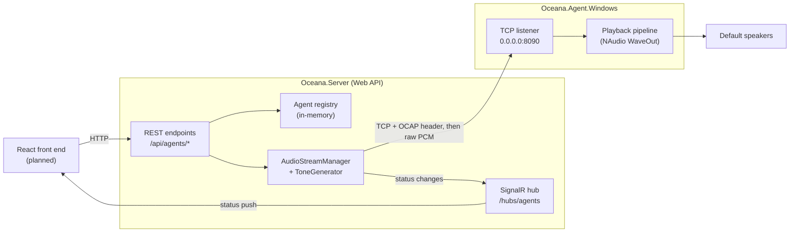
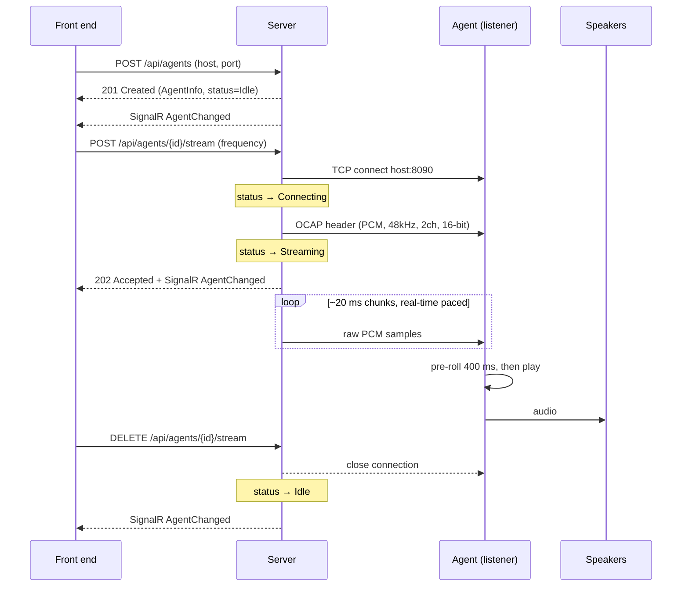

# Architecture

> How Oceana's pieces fit together, how the server and agent connect, and how audio flows end to end.

## Components

Oceana is three deployable/shared pieces plus a planned front end:

| Component | Project | Role |
|-----------|---------|------|
| **Protocol** | [`Oceana.Protocol`](../src/Oceana.Protocol) | Shared library defining the OCAP wire format. Referenced by both server and agent so they share one definition of the header. No dependencies on Windows/NAudio/ASP.NET. |
| **Agent** | [`Oceana.Agent.Windows`](../src/Oceana.Agent.Windows) | Runs on a playback machine. Listens for a connection, receives an audio stream, and plays it to the local default output device. |
| **Server** | [`Oceana.Server`](../src/Oceana.Server) | Central control plane. Manages a registry of agents and streams audio out to them. Exposes a REST + SignalR API. |
| **Front end** *(planned)* | — | A React app that will drive the server's REST API and subscribe to SignalR for live status. Not yet built. |

## The connection model (important)

The direction of the network connection is deliberately **inverted** from what people often assume:

- The **agent is a TCP listener**. It binds `0.0.0.0:8090` (all interfaces) and waits.
- The **server is the TCP client**. When told to stream to an agent, it **dials out** to that agent's `host:port`, sends a handshake header, then pushes audio.

So "the server manages the agents connected to it" really means "the server manages the agents **it** connects out to." The server keeps a registry of agent endpoints (added via its REST API) and opens an outbound connection per stream.

> **Why this way?** It keeps the agent dead simple and firewall-friendly on the playback side (no inbound discovery/registration protocol on the agent), and it lets the server decide when audio flows. The trade-off — the server must be told each agent's address — is handled by the API-managed registry (see [server.md](./server.md)).

## End-to-end data flow

The audio path is **server → agent**; the control path is **front end ↔ server** (REST out, SignalR status back). The agent never talks to the front end directly.

### Starting a stream (sequence)

Details of the header live in [protocol.md](./protocol.md); the playback side in [agent.md](./agent.md); the server side in [server.md](./server.md).

## Server-side structure: vertical slices + shared infrastructure

The server is organised by **feature (vertical slice)** rather than by technical layer:

- `Features/Agents/` — the **Agents slice**: one folder per endpoint (REPR-style), plus the agent registry and domain models.
- `Infrastructure/Streaming/` and `Infrastructure/Realtime/` — **shared** technical services (tone generation, the TCP connection, SignalR plumbing) that aren't a feature in themselves.

> **Intentional dependency note.** The shared `Infrastructure` code references the Agents slice's domain types (`AgentInfo`, `AgentStatus`, `IAgentRegistry`). While **Agents is the only slice**, this is fine — infrastructure serving the sole domain. When a second slice appears, those shared contracts should be lifted into a neutral "kernel" so infrastructure no longer depends on a specific slice. Tracked in [roadmap.md](./roadmap.md).

## Glossary

| Term | Meaning |
|------|---------|
| **Agent** | A playback endpoint (`Oceana.Agent.Windows`) that receives and plays an audio stream. Acts as the TCP *listener*. |
| **Server** | The control plane (`Oceana.Server`) that manages agents and streams audio to them. Acts as the TCP *client*. |
| **OCAP** | "Oceana Audio Protocol" — the wire format: a fixed 16-byte handshake header followed by raw PCM. See [protocol.md](./protocol.md). |
| **Pre-roll** | The amount of audio the agent buffers (400 ms) before it starts playing, to absorb network jitter. |
| **REPR** | Request–Endpoint–Response — the FastEndpoints pattern where each endpoint is its own class. |
| **MTP** | Microsoft.Testing.Platform — the modern .NET test runner the test projects use (xUnit v3). See [development.md](./development.md). |
| **VSA** | Vertical Slice Architecture — organising code by feature rather than by technical layer. |
